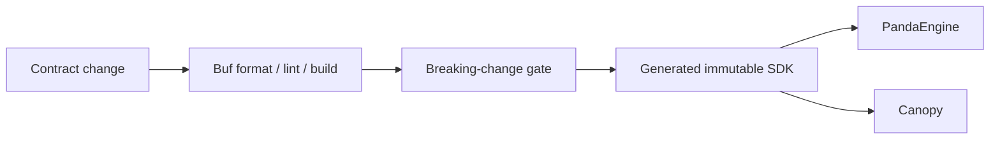
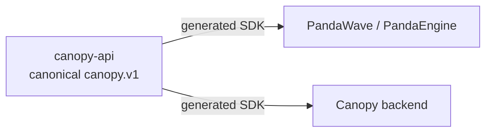

<div align="center">

# 🔌 canopy-api

### One versioned wire contract. Independent client and server evolution.

[](proto/canopy/v1/canopy.proto)
[](https://grpc.io/)
[](https://buf.build/)
[](https://github.com/adrianrusu16/canopy-api/actions/workflows/buf-ci.yml)

[Case study](https://adrianrusu.dev/projects/canopy-api/) ·
[Consumer guide](docs/consumer-guide.md) ·
[Compatibility](docs/compatibility.md) ·
[Changelog](CHANGELOG.md)

</div>

---

**canopy-api** is the public, product-neutral Protobuf/gRPC source contract shared by PandaEngine and Canopy.

The current API package is:

```text
canopy.v1
```

The repository defines **wire shape and shared semantics**. Backend deployment, transport configuration, UI behavior and implementation-specific policy remain in their owning repositories.

> **Generated interfaces guarantee shape. Compatibility policy preserves the agreement around that shape.**

---

## ⚡ 60-second reviewer path

| If you want to inspect… | Start here |
|---|---|
| 📜 **Canonical wire contract** | [`canopy.proto`](proto/canopy/v1/canopy.proto) |
| 🔐 **Authentication semantics** | [Fail-closed identity semantics](#-fail-closed-identity-semantics) |
| 📦 **Generated SDK consumption** | [Consumer guide](docs/consumer-guide.md) |
| 🧱 **Compatibility discipline** | [Compatibility rules](#-compatibility-rules) and [compatibility guide](docs/compatibility.md) |
| 🧪 **Contract validation** | [Development](#-development) |
| 🧭 **Guided project narrative** | [canopy-api case study](https://adrianrusu.dev/projects/canopy-api/) |

> **The repository is intentionally narrow:** it owns the shared agreement between client and server, not either implementation.

---

## 🧭 Contract at a glance

| Item | Location |
|---|---|
| Canonical schema | [`proto/canopy/v1/canopy.proto`](proto/canopy/v1/canopy.proto) |
| BSR module | `buf.build/pandawave/canopy-api` |
| Stable release | `v0.3.0` (`ff8940d1a15b4034bb430fd47dd45cdc`) |
| Consumer integration | [`docs/consumer-guide.md`](docs/consumer-guide.md) |
| Compatibility rules | [`docs/compatibility.md`](docs/compatibility.md) |
| Release history | [`CHANGELOG.md`](CHANGELOG.md) |

The source repository is public. The current BSR module / generated package distribution may require configured access as documented by the consumer guide.

---

## 🧩 Service surface

| Service | Responsibility | Access |
|---|---|---|
| `CatalogService` | browse, search and catalog metadata | anonymous-capable |
| `PlaybackService` | resolve an opaque expiring playback source | anonymous-capable |
| `DiscoveryService` | discovery / For You / recommendation feeds | anonymous-capable |
| `ProfileService` | profile lifecycle and preferences | authenticated profile |
| `HistoryService` | history consent and playback history | authenticated profile |
| `LibraryService` | saved tracks and likes | authenticated profile |
| `PlaylistService` | playlists and ordered membership | authenticated profile |
| `AuthService` | credentials, verification, provider identity and sessions | bootstrap + authenticated methods |
| `SystemService` | application/dependency status | public |

---

## 🔐 Fail-closed identity semantics

Optional authentication is **not** permission to ignore bad authentication.

| Request state | Contract interpretation |
|---|---|
| No identity on an anonymous-capable RPC | apply anonymous policy |
| Valid bearer identity | apply authenticated context |
| Supplied invalid / expired / revoked identity | return `UNAUTHENTICATED` |

This distinction is part of the shared API semantics so that consumers and implementations cannot silently disagree about authentication failure.

---

## 📦 Generated SDKs & immutable pins

The Buf Schema Registry publishes generated SDKs from this contract.

Consumers should discover releases by label if useful, but builds should pin generated packages to immutable revisions rather than following a mutable branch/tag-like reference.



For the current Rust setup and package coordinates, follow [`docs/consumer-guide.md`](docs/consumer-guide.md).

---

## 🧪 Development

Install a compatible Buf CLI and run:

```bash
buf format --diff --exit-code
buf lint
buf build
bash scripts/check-contract-boundary.sh
```

CI performs the same baseline contract validation.

Pull requests also run breaking-change checks against their Git base; pushes are validated against the stable BSR release before publication.

---

## 🧱 Compatibility rules

Backward-compatible additions stay in:

```text
canopy.v1
```

A breaking redesign belongs in a new package generation such as:

```text
canopy.v2
```

Released `canopy.v1` fields and semantics are not repurposed just because both consumers happen to be under active development.

Before changing the contract:

1. read [`CONTRIBUTING.md`](CONTRIBUTING.md);
2. update Protobuf comments and consumer documentation together;
3. update [`CHANGELOG.md`](CHANGELOG.md);
4. run format/lint/build;
5. run compatibility checks.

See [`docs/compatibility.md`](docs/compatibility.md).

---

## 🔗 Ecosystem



| Consumer | Role |
|---|---|
| [`PandaWave`](https://github.com/adrianrusu16/PandaWave) | Android/AAOS client with PandaEngine |
| [`Canopy`](https://github.com/adrianrusu16/Canopy) | Rust/Tonic backend implementation |

---

<div align="center">

**ONE CONTRACT · INDEPENDENT CONSUMERS · EXPLICIT UPGRADES**

[Explore the canopy-api case study →](https://adrianrusu.dev/projects/canopy-api/)

</div>
